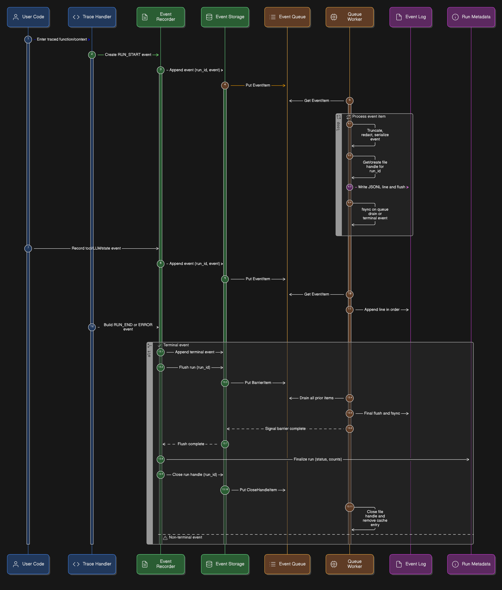

# 001. IMPLEMENTATION RECORD: ASYNC QUEUE-BASED EVENT WRITER

---

## IMPLEMENTATION METADATA

| Field | Value |
| :--- | :--- |
| **title** | feat: implement async queue event writer and hardened redaction engine |
| **status** | DRAFT |
| **author** | [Srinjoy Nag](https://github.com/sinehypernova-0718) |
| **created** | 2026-04-04 at 10:11:00 UTC |
| **implemented** |  |
| **last_updated** |  |
| **release_version** | v0.2.5 |
| **tags** | `core`, `tracing`, `performance`, `thread-safety`, `storage` |

## GITHUB

| Field | Value |
|-------|-------|
| **Pull Request** |  |
| **Commit1** | [406f11c77eef1278757b939d0f289949a330a68b](https://github.com/AgentDbg/agentdbg/commit/406f11c77eef1278757b939d0f289949a330a68b) **[Add implementation for record for queue based event writer]** |
| **Commit2** | [ef0957b30ba1025cda825480ba84627a70211d13](https://github.com/AgentDbg/agentdbg/commit/ef0957b30ba1025cda825480ba84627a70211d13) **[Implement async queue-based event writer with unit tests for error handling]** |
| **Commit3** | [cb3466cf2c08a2493a50c9e1d9b12eb27e7b099a](https://github.com/AgentDbg/agentdbg/commit/cb3466cf2c08a2493a50c9e1d9b12eb27e7b099a) **[Refactor async event writer to improve batch processing and error handling; add AgentDbgStorageError for storage failures]** |
| **Commit4** | [a73e611c80e8439f314ce87bd984b2724de90d52](https://github.com/AgentDbg/agentdbg/commit/a73e611c80e8439f314ce87bd984b2724de90d52) **[Add truncation logic for large values and implement JSON scrubbing for secret tokens]** |
| **Commit5** | [15b43256b0404392dd53738821e757e43b4b765e](https://github.com/AgentDbg/agentdbg/commit/15b43256b0404392dd53738821e757e43b4b765e) **[Refactor redaction utilities for clarity and enhance test coverage for sensitive data scrubbing and fix fast unit tests failures]** |
| **Commit6** |  **[]** |
| **Commit7** |  **[]** |
| **Commit8** |  **[]** |

---

## 1. SUMMARY

This update replaces the old synchronous event-writing flow with a background, queue-based writer.

Earlier, every event went through the full cycle: `open -> write -> flush -> fsync -> close`. It was simple and safe, but it meant the caller thread had to wait on disk I/O every time.

The new system separates responsibilities:

- The tracing code creates events and pushes them into a queue.
- A dedicated worker thread pulls from that queue and writes to disk.
- When a run finishes, the system flushes queued writes before updating `run.json`.

In practice, this makes the system feel much smoother:

- tracing no longer blocks on most disk writes
- writes happen in a controlled, single-threaded way
- file ordering stays consistent
- file handles are reused instead of churned per event
- redaction is stronger, especially for tokens hidden inside strings

---

## 2. WHY THIS CHANGE WAS NEEDED

The old approach worked fine at small scale, but it didn't match how modern agent systems behave.

| Problem Area | Old Behavior | Impact |
| :--- | :--- | :--- |
| **Latency** | Each event waited for disk flush | Tracing became unnecessarily expensive |
| **Concurrency** | Multiple threads wrote to the same file | Risk of corrupted or mixed lines |
| **Handle churn** | Open/close per event | Extra system overhead |
| **Security** | Only key-based redaction | Tokens in URLs or strings could leak |
| **Durability ordering** | Files updated independently | Final state could become inconsistent |

---

## 3. FINAL ARCHITECTURE

### 3.1 High-Level Model

The system now follows a strict rule:

- many threads can produce events
- only one thread writes them to disk

That single decision removes most of the complexity around race conditions.

---

### 3.2 Architecture Diagram

---

## 4. WHAT WAS ACTUALLY IMPLEMENTED

### Phase A: Worker Core

New file: `agentdbg/_tracing/writer.py`

Core components:

- `EventQueueWorker`
- `EventItem`
- `BarrierItem`
- `CloseHandleItem`
- `_SHUTDOWN_SIGNAL`

Key behavior:

- The worker starts only when needed
- The queue has a fixed size (`2048`) to avoid unbounded memory growth
- File handles are opened once per run and reused
- Handles are explicitly closed when the run ends
- Any leftover handles are cleaned up during shutdown
- A module-level `atexit` hook shuts down live workers during interpreter exit

This is especially important on Windows, where open handles can prevent deletion.

---

### Phase B: Storage Bridge

Modified file: `agentdbg/storage.py`

Main changes:

- `append_event(...)` enqueues `EventItem` objects instead of writing directly
- Added process-local worker lifecycle helpers: `flush_run(...)`, `close_run_handle(...)`, and `finalize_storage(...)`
- `load_events(...)` flushes queued writes before reading `events.jsonl`
- `delete_run(...)` closes cached handles before removing run directories

Effect:

- Reads observe durable event data
- Deletion works correctly across platforms
- Storage coordination stays in one place instead of being scattered across callers

---

### Phase C: Lifecycle and Shutdown

Modified files:

- `agentdbg/_tracing/_lifecycle.py`
- `agentdbg/_tracing/_context.py`

Finalization now follows the queue-backed sequence used by both explicit and implicit runs:

 append_event(RUN_END)
-> flush_run(run_id)
-> finalize_run(...)
-> close_run_handle(run_id)

`append_event(...)` enqueues the event, `flush_run(...)` blocks until prior writes are durable, and `close_run_handle(...)` performs a final flush before closing the cached handle. This keeps `run.json` updates ordered after `events.jsonl` durability while still using the background writer.

Additional improvements:

- Implicit runs follow the same finalization logic
- Tracing shutdown is coordinated in one place before storage shutdown
- The worker can be force-stopped during shutdown if the queue is full

---

### Phase D: Redaction Hardening

Modified file: `agentdbg/_tracing/_redact.py`

Enhancements:

- Split truncation and redaction into separate steps
- Added serialization-time scrubbing
- Introduced regex detection for:
  - OpenAI-style keys
  - GitHub tokens
  - Bearer tokens

Redaction now happens in two stages:

1. Light truncation before enqueue (to control memory)
2. Full redaction and token scrubbing before writing to disk

This keeps the hot path fast while improving security.

---

## 5. DETAILED UNDER-THE-HOOD NOTES

### 5.1 Handle Cleanup Strategy

- First event -> open file
- Subsequent events -> reuse handle
- End of run -> flush, sync, close
- Shutdown -> clean up anything left

This avoids both excessive handle usage and leaks.

---

### 5.2 Barrier Semantics

`BarrierItem` ensures ordering:

- all previous events are written first
- worker flushes and syncs
- only then does execution continue

This guarantees that `run.json` reflects a fully written event stream.

---

### 5.3 Fatal Worker Errors

If something goes wrong during file or handle I/O:

- the worker records an `AgentDbgStorageError`
- logs the issue
- closes all handles
- surfaces the error on later operations

Serialization failures are handled differently: the worker logs and skips malformed individual events so one bad payload does not disable persistence for every run.

---

### 5.4 Atexit Ordering

Shutdown sequence:

1. finalize implicit runs
2. stop the storage worker

This ensures queued events are flushed before interpreter exit.

---

## 6. FILE INVENTORY

| File | Change Type | Main Work Done |
| :--- | :--- | :--- |
| `agentdbg/_tracing/writer.py` | New | Worker thread, batching, barriers, and handle lifecycle |
| `agentdbg/storage.py` | Modified | Queue-backed storage bridge and worker lifecycle helpers |
| `agentdbg/_tracing/_lifecycle.py` | Modified | Flush/finalize/close ordering for explicit runs |
| `agentdbg/_tracing/_context.py` | Modified | Implicit-run finalization and shutdown coordination |
| `agentdbg/_tracing/_redact.py` | Modified | Truncation and write-time scrubbing improvements |
| `agentdbg/exceptions.py` | Modified | Added storage error type |
| `tests/tracing/test_stress.py` | New | Concurrency and batching stress coverage |
| `tests/tracing/test_writer.py` | New | Worker failure, shutdown, and batching coverage |
| `tests/test_storage.py` | Modified | Queue-backed storage validation |
| `tests/test_redaction.py` | Modified | Security and scrubbing coverage |
| `tests/test_implicit_run.py` | Modified | Implicit-run stability fixes |
| `tests/conftest.py` | Modified | Test setup updates |
| `README.md` | Modified | Documentation updates |
| `docs/architecture.md` | Modified | Architecture description |
| `pytest.toml` | Modified | Test config cleanup |

---

## 7. NON-FUNCTIONAL REQUIREMENTS AND FINAL OUTCOME

### Performance

| Requirement | Outcome |
| :--- | :--- |
| Avoid per-event `fsync` on the caller thread | Achieved |
| Keep tracing lightweight | Achieved |
| Reduce handle churn | Achieved |

### Reliability

| Requirement | Outcome |
| :--- | :--- |
| Maintain ordering | Achieved |
| Prevent corruption from concurrent writers | Achieved |
| Ensure correct finalization | Achieved |
| Surface worker I/O failures | Achieved |

### Security

| Requirement | Outcome |
| :--- | :--- |
| Preserve existing redaction | Preserved |
| Detect hidden tokens | Achieved |
| Keep local-only model | Preserved |

---

## 8. EDGE CASES AND IMPLEMENTED BEHAVIOR

| Edge Case | Behavior |
| :--- | :--- |
| Disk full / write failure | Fatal worker error is stored and surfaced later |
| Queue saturation | Enqueue fails instead of growing indefinitely |
| Read during active run | `flush_run(...)` completes before reading |
| Windows delete with open file | Handle is closed before directory removal |
| Implicit run exit | `RUN_END`, flush, finalize, and close are coordinated at shutdown |
| Serialization failure for one event | Event is logged and skipped without disabling the worker |
| Interrupts (`SystemExit`, `KeyboardInterrupt`) | No artificial events added |
| SIGTERM | Best effort |
| SIGKILL | No recovery possible |

---

## 9. VERIFICATION SUMMARY

### Coverage

- Multi-thread safety
- Batch-size and shutdown behavior
- Durability ordering around flush barriers
- Token leakage prevention
- Safe cleanup behavior
- Worker failure propagation

---

## 10. KNOWN LIMITATION FROM LOCAL ENVIRONMENT

Some local validation commands still depend on machine-specific tooling and permissions.

Current status:

- The implementation record now matches the queue-backed code path in the repository
- Targeted storage and writer verification exists in the test suite
- Full validation remains best confirmed in CI

---

## 11. FINAL DELIVERABLE SUMMARY

| Area | Final State |
| :--- | :--- |
| **Architecture** | Async queue-based single-writer model |
| **Durability** | Flush enforced before finalization |
| **Security** | Regex-based scrubbing added |
| **Compatibility** | No API changes |
| **Documentation** | Aligned to current implementation |
| **Tests** | Expanded around storage, writer, and shutdown behavior |

---
